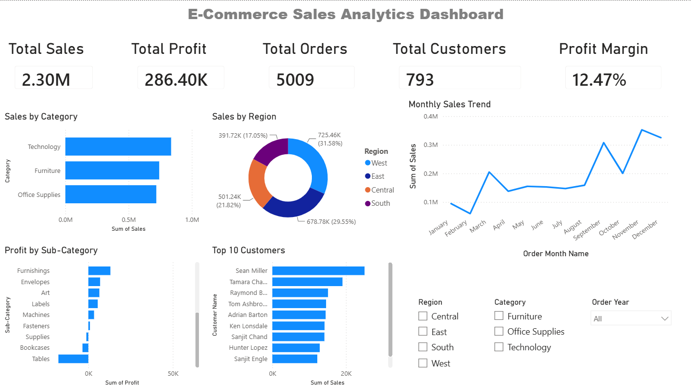

# E-Commerce Sales Analytics Dashboard

## Project Overview

This project analyzes retail sales data from a Superstore dataset to uncover business insights related to sales, profitability, customers, products, and regional performance.

The project includes:

- Data Cleaning using Python and Pandas
- Exploratory Data Analysis (EDA)
- Customer Segmentation using K-Means Clustering
- Interactive Dashboard Development using Power BI

---

## Tools & Technologies

- Python
- Pandas
- NumPy
- Matplotlib
- Seaborn
- Scikit-Learn
- Jupyter Notebook
- Power BI

---

## Dataset

- Dataset: Sample Superstore Dataset
- Total Records: 9,994
- Features: 21 columns

---

## Key Business Insights

### Revenue Performance

- Total Sales: 2.30 Million
- Total Profit: 286.40 Thousand
- Profit Margin: 12.47%

### Product Insights

- Technology generated the highest sales.
- Copiers were the most profitable sub-category.
- Tables produced the highest losses.

### Regional Insights

- West region contributed the highest revenue.
- California and New York were the best-performing states.
- Texas and Ohio generated significant losses.

### Seasonal Trends

- Sales increased significantly from September to December.
- November recorded one of the highest sales volumes.

### Customer Analysis

- Top customers contributed a major share of revenue.
- K-Means clustering identified High-Value, Medium-Value, and Low-Value customer segments.

---

## Dashboard



---

## Project Structure

```text
E-Commerce-Sales-Analytics-Dashboard
│
├── data
│   ├── raw
│   │   └── Sample - Superstore.csv
│   │
│   └── cleaned
│       └── superstore_cleaned.csv
│
├── notebooks
│   └── project_summary.ipynb
│
├── dashboard
│   └── ecommerce_sales_dashboard.pbix
│
├── images
│   └── dashboard.png
│
└── README.md
```

---

## Author

**Ruchi Kawale**